# One Challenge Forum


Este proyecto es una solución backend para el desafío "Foro Hub" de Oracle Next Education (ONE) y Alura. Consiste en una API RESTful desarrollada con **Spring Boot** para gestionar tópicos de discusión, implementando las mejores prácticas de desarrollo, persistencia de datos y **seguridad robusta**.

## Tecnologías

*   **Java 25** (Compatible con versiones recientes)
*   **Spring Boot 4**
*   **Spring Security 6+** (Autenticación y Autorización)
*   **JWT (JSON Web Tokens)** (Seguridad Stateless)
*   **Spring Data JPA** (Hibernate)
*   **PostgreSQL** (Infrasctructura de Datos)
*   **Flyway** (Migraciones de base de datos)
*   **Lombok** (Reducción de boilerplate)
*   **MapStruct** (Mapeo eficiente de Entidades <-> DTOs)

## Configuración del Entorno y Ejecución

Para ejecutar la aplicación, primero define las siguientes variables de entorno (por ejemplo, en un archivo `.env` en la raíz del proyecto):

| Variable | Descripción | Ejemplo |
| :--- | :--- | :--- |
| `DEV_DB_URL` | URL de conexión a PostgreSQL | `jdbc:postgresql://localhost:5432/foro_hub` |
| `DEV_DB_USERNAME` | Usuario de la base de datos | `postgres` |
| `DEV_DB_PASSWORD` | Contraseña del usuario | `admin123` |
| `JWT_SECRET` | Clave secreta para firmar tokens | `mi_super_secreto_123` |

### Cómo correr el proyecto (Linux/macOS)

Si usas un entorno basado en Unix y tienes tus variables configuradas en un archivo `.env`, puedes usar este atajo (joyita) para exportar las variables e iniciar el servidor de Spring Boot en un solo comando:

```bash
export $(cat .env | xargs) && ./mvnw spring-boot:run
```

Esto cargará la base de datos, ejecutará las migraciones de Flyway y levantará la API en el puerto `8080`.

### DEMO

https://github.com/user-attachments/assets/68778d0c-20cc-4970-806e-d5a71bd7043c

## Endpoints Principales

### Autenticación (Públicos)
| Método | Endpoint | Descripción | Body Requerido |
| :--- | :--- | :--- | :--- |
| **POST** | `/auth/register` | **Registrar Usuario**. Crea un nuevo usuario con rol `ROLE_STUDENT`. | `{ "name": "...", "email": "...", "password": "..." }` |
| **POST** | `/auth/login` | **Iniciar Sesión**. Devuelve un JWT válido por 2 horas. | `{ "email": "...", "password": "..." }` |

### Tópicos (Protegidos - Requieren Bearer Token)
Todo request a estos endpoints debe incluir el header: `Authorization: Bearer <tu_token>`

| Método | Endpoint | Descripción |
| :--- | :--- | :--- |
| **POST** | `/topics` | **Crear Tópico**. Requiere título, mensaje, autor y curso. Valida duplicados. |
| **GET** | `/topics` | **Listar Tópicos**. Retorna lista paginada de tópicos activos. |
| **GET** | `/topics/{id}` | **Detalle Tópico**. Obtiene la información completa de un tópico por su ID. |
| **PUT** | `/topics/{id}` | **Actualizar Tópico**. Actualiza título o mensaje de forma transaccional. |
| **DELETE** | `/topics/{id}` | **Eliminar Tópico (Lógico)**. Cambia el estado a `DELETED`. |

## Documentación de la API (Swagger UI)

Este proyecto integra **Springdoc OpenAPI 3** para la generación automática de la documentación interactiva de la API. Esta interfaz reemplaza la necesidad de usar herramientas externas como Postman para las pruebas manuales.

Para acceder a la documentación interactiva:
1. Inicia la aplicación.
2. Navega en tu navegador a: `http://localhost:8080/api/v1/swagger-ui.html`

### Cómo probar Endpoints Protegidos en Swagger
1. Ve a la sección **Autenticación** y ejecuta el endpoint `POST /auth/login` con tus credenciales.
2. Copia el `token` (JWT) de la respuesta.
3. Desplázate hacia arriba y haz clic en el botón verde **Authorize**.
4. Pega el token y haz clic en "Authorize".
5. ¡Listo! Ahora todos los endpoints que requieren autenticación enviarán automáticamente el header `Authorization: Bearer <token>`.

## Arquitectura y Diseño (Diagrama de Clases)

El sistema sigue una arquitectura en capas con separación de responsabilidades para la seguridad.

```mermaid
classDiagram
    class OneChallengeForumApplication {
        +main(String[]) void
    }

    class OpenApiConfig {
        +customOpenAPI() OpenAPI
    }

    class SecurityConfig {
        +securityFilterChain(HttpSecurity, SecurityFilter) SecurityFilterChain
        +passwordEncoder() PasswordEncoder
        +authenticationManager(AuthenticationConfiguration) AuthenticationManager
    }

    class SecurityFilter {
        -tokenService TokenService
        -userRepository UserRepository
        #doFilterInternal(HttpServletRequest, HttpServletResponse, FilterChain) void
        -recoverToken(HttpServletRequest) String
    }

    class AuthController {
        -authenticationService AuthenticationService
        +register(RegisterUserDto) ResponseEntity~Void~
        +login(LoginUserDto) ResponseEntity~JwtTokenDto~
    }

    class TopicController {
        -topicService TopicService
        +create(TopicCreateDto) TopicResponseDto
        +findAll(Pageable) Page~TopicResponseDto~
        +findById(Long) TopicResponseDto
        +update(Long, TopicUpdateDto) TopicResponseDto
        +delete(Long) void
    }

    class JwtTokenDto {
        <<record>>
        +token String
    }

    class LoginUserDto {
        <<record>>
        +email String
        +password String
    }

    class RegisterUserDto {
        <<record>>
        +name String
        +email String
        +password String
    }

    class TopicCreateDto {
        <<record>>
        +title String
        +message String
        +authorId Long
        +courseId Long
    }

    class TopicResponseDto {
        <<record>>
        +id Long
        +title String
        +message String
        +creationDate LocalDateTime
        +status String
        +authorId Long
        +authorName String
        +courseId Long
        +courseName String
    }

    class TopicUpdateDto {
        <<record>>
        +title String
        +message String
    }

    class DuplicateResourceException {
    }

    class ErrorResponse {
        <<record>>
        +status int
        +message String
        +timestamp LocalDateTime
    }

    class GlobalExceptionHandler {
        +handleNotFound(ResourceNotFoundException)
        +handleDuplicate(DuplicateResourceException)
        +handleValidationErrors(MethodArgumentNotValidException)
        +handleGenericError(Exception)
    }

    class ResourceNotFoundException {
    }

    class TopicMapper {
        <<interface>>
        +toDTO(Topic) TopicResponseDto
        +toEntity(TopicCreateDto, User, Course) Topic
    }

    class Course {
        -id Long
        -name String
        -category String
    }

    class Profile {
        -id Long
        -name String
    }

    class Response {
        -id Long
        -message String
        -topic Topic
        -creationDate LocalDateTime
        -author User
        -solution Boolean
    }

    class Topic {
        -id Long
        -title String
        -message String
        -creationDate LocalDateTime
        -status String
        -author User
        -course Course
    }

    class User {
        -id Long
        -name String
        -email String
        -password String
        -profile Profile
        +getAuthorities() Collection
        +getUsername() String
        +isAccountNonExpired() boolean
        +isAccountNonLocked() boolean
        +isCredentialsNonExpired() boolean
        +isEnabled() boolean
    }

    class CourseRepository {
        <<interface>>
    }

    class ProfileRepository {
        <<interface>>
        +findByName(String) Optional~Profile~
    }

    class TopicRepository {
        <<interface>>
        +existsByTitleAndCourseId(String, Long) boolean
        +findByStatus(String, Pageable) Page~Topic~
    }

    class UserRepository {
        <<interface>>
        +findByEmail(String) Optional~User~
        +existsByEmail(String) boolean
    }

    class AuthenticationService {
        -userRepository UserRepository
        -profileRepository ProfileRepository
        -passwordEncoder PasswordEncoder
        -authenticationManager AuthenticationManager
        -tokenService TokenService
        +register(RegisterUserDto) void
        +login(LoginUserDto) JwtTokenDto
    }

    class TokenService {
        -apiSecret String
        +generateToken(User) String
        +getSubject(String) String
    }

    class UserDetailsServiceImpl {
        -userRepository UserRepository
        +loadUserByUsername(String) UserDetails
    }

    class TopicService {
        <<interface>>
        +create(TopicCreateDto) TopicResponseDto
        +findAll(Pageable) Page~TopicResponseDto~
        +findById(Long) TopicResponseDto
        +update(Long, TopicUpdateDto) TopicResponseDto
        +delete(Long) void
    }

    class TopicServiceImpl {
        -topicRepository TopicRepository
        -userRepository UserRepository
        -courseRepository CourseRepository
        -topicMapper TopicMapper
        +create(TopicCreateDto) TopicResponseDto
        +findAll(Pageable) Page~TopicResponseDto~
        +findById(Long) TopicResponseDto
        +update(Long, TopicUpdateDto) TopicResponseDto
        +delete(Long) void
    }

    %% Relationships
    SecurityFilter --> TokenService : uses
    SecurityFilter --> UserRepository : uses
    AuthController --> AuthenticationService : uses
    TopicController --> TopicService : uses
    AuthenticationService --> UserRepository : uses
    AuthenticationService --> ProfileRepository : uses
    AuthenticationService --> TokenService : uses
    UserDetailsServiceImpl --> UserRepository : uses
    TopicServiceImpl ..|> TopicService : implements
    TopicServiceImpl --> TopicRepository : uses
    TopicServiceImpl --> UserRepository : uses
    TopicServiceImpl --> CourseRepository : uses
    TopicServiceImpl --> TopicMapper : uses
    
    User --> Profile : has
    Topic --> User : author
    Topic --> Course : has
    Response --> Topic : belongs to
    Response --> User : author
```



## Seguridad Implementada

1.  **Stateless Authentication**: No se usan sesiones de servidor. Cada petición es validada independientemente vía JWT.
2.  **Password Encryption**: Todas las contraseñas se almacenan hasheadas con **BCrypt**.
3.  **Role Based Access Control (RBAC)**: Preparado para manejar roles (`ROLE_ADMIN`, `ROLE_STUDENT`) asociados a cada `User` mediante la entidad `Profile`.
4.  **Segregación de Interfaces**:
    *   `AuthenticationService`: Maneja la lógica de negocio (login/registro).
    *   `UserDetailsServiceImpl`: Maneja la carga técnica de usuarios para Spring Security, rompiendo dependencias circulares.

## Contribución

Este proyecto sigue la convención de **Conventional Commits**:
*   `feat`: Nueva funcionalidad.
*   `fix`: Corrección de errores.
*   `refactor`: Cambios de código que no alteran la funcionalidad.
*   `docs`: Cambios en documentación.
*   `build`: Cambios en dependencias o scripts de construcción.
